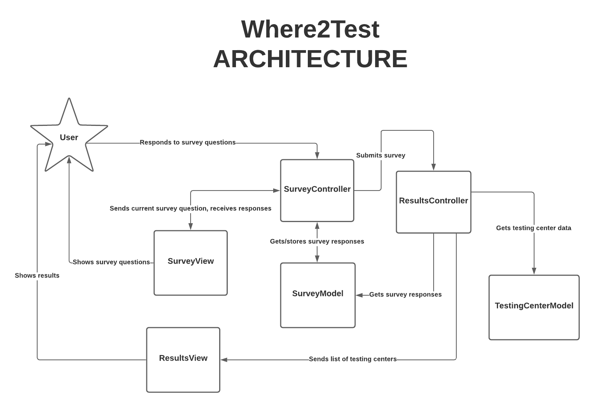

# Where2Test Architecture 

## SurveyController
- Resides in the client
- The **SurveyController** communicates with the **SurveyModel** and **SurveyView**
- The **SurveyController** can ask the **SurveyModel** to store responses to survey questions
- The **SurveyController** can retrieve a specific survey question response from the **SurveyModel**
- The **SurveyController** can keep track of the order of the survey questions and the current question that the user is on
- The **SurveyController** can go next or back in the survey question ordering
- The **SurveyController** can direct the **SurveyView** to the current question to display

## SurveyController Stubs
```
// Stores the given response to the given survey question and moves to the next surveyQuestion
function goNextSurveyQuestion(response) {
	surveyQuestion = getCurrentQuestion();
	surveyResponses[surveyQuestion] = response;
	// Moves survey question tracker forward one
}

// Returns the previous survey question response and moves back to the previous surveyQuestion
function goBackSurveyQuestion {
	// Moves survey question tracker back one
	return getSurveyResponse(previousQuestion);
}

// Submits the survey 
function submitSurvey {
	// Calls on ResultsController to compute results
}

// Returns the survey response to the given survey question
function getSurveyResponse(surveyQuestion) {
	return surveyResponses[surveyQuestion]
}

// Returns the current survey question
function getCurrentQuestion() {
	return surveyQuestion;
}

```

## ResultsController
- Resides in the client 
- The **ResultsController** communicates with the **TestingCenterModel** in Firebase, the **SurveyModel**, the **ResultsView**, and the Google Maps API
- The **ResultsController** can ask the **SurveyModel** to retrieve all responses and their corresponding survey questions
- The **ResultsController** can ask the **TestingCenterModel** to retrieve all testing centers data
- The **ResultsController** computes the testing center results list through filtering and sorting using the **SurveyModel** responses from the **TestingCenterModel** data

```
 
// Returns all survey responses
function getSurveyResponses() {
	return surveyResponses;
}

// Returns an array of objects of testing center data
function getTestingCenters() {
	return testingCenters;
}

// Returns a filtered and sorted list of objects of testing centers
function computeResults() {
	surveyResponses = getSurveyResponses();
	testingCenters = getTestingCenters();
	// filter and sort testing center list of objects
	// append distance away from provided address (using Google Maps API) to testing centers list of objects
	return results; 
}

```
## SurveyModel
- Resides in the client
- The **SurveyController** can ask the **SurveyModel** for a specific survey question response
- The **ResultsController** can ask the **SurveyModel** for survey question responses
- The **SurveyModel** stores the survey questions (across all instances of the survey) and locally stores each user’s responses
```
SurveyModel = {
	question: string;
	response: string;
	hasNext: boolean;
	hasBack: boolean;
	hasSubmit: boolean;
}
```

## TestingCenterModel
- Resides in Firebase
- The ResultsController can ask the TestingCenterModel for testing center data
- This TestingCenterModel stores the testing centers data including information such as: … about each testing center

```
TestingCenterModel = {
	name: string;
	phone: string;
	address: string;
	symptomaticAllowed: boolean;
	takesInsurance: boolean;
	referralRequired: boolean;
	driveThroughAvailable: boolean;
	translatorAvailable: boolean;
}

```

## SurveyView
- Resides in the client
- The **SurveyView** receives information to display from the **SurveyController**
- Displays survey question and question description (if it has one)
- Displays asterisk for required questions
- Displays text fields and checkboxes 
- Displays next, back buttons to move from question to question
- Displays a start and submit button (for applicable pages)

## ResultsView
- Resides in the client
- The **ResultsView** receives information to display from the **ResultsController**
- The **ResultsView** displays a list of “cards” of testing centers



