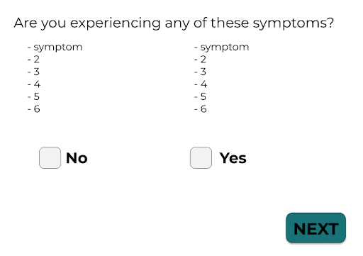
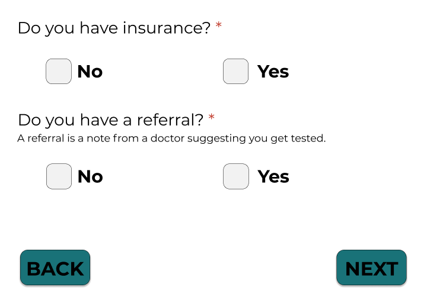
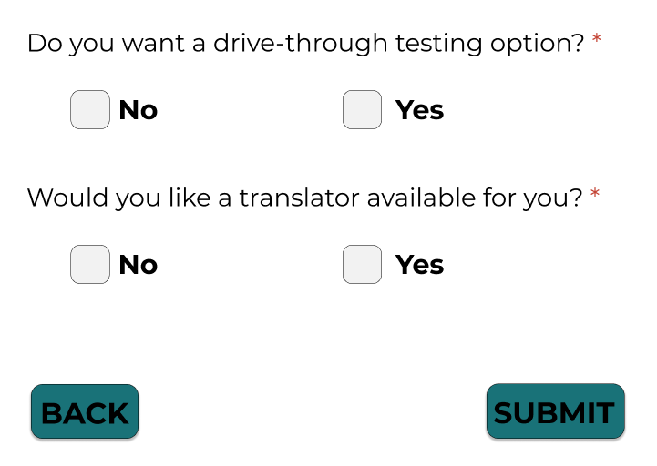
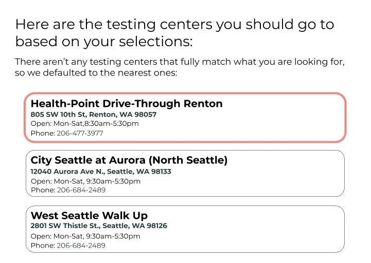

# PROBLEM: #
Currently, people around Seattle are encouraged to get tested for COVID-19, however, it is [not completely an equitable process to get tested](https://www.kff.org/coronavirus-covid-19/issue-brief/low-income-and-communities-of-color-at-higher-risk-of-serious-illness-if-infected-with-coronavirus/). Google provides a list of COVID-19 testing centers with broad information such as whether it is drive through and whether you need an appointment. However, there are many other factors that disproportionately impact low income and minority communities from getting tested such as insurance, price, and language barriers. Due to these barriers and not having all testing center accomodations consolidated on one platform, it makes it difficult for low income and minority groups to find a suitable testing site thus making it even more inconvenient for them to get tested. 

# SOLUTION: #
Our solution is a website survey to help users find an appropriate testing center that meets their accommodations. 

When you reach our website’s landing page, there will be a short description of the survey telling you that the survey will help you find nearby COVID-19 testing centers based upon your needs. Under the short description there will be a “START” button, when pressed, will commence the survey.

Once you click start, you are brought up to the first screen which asks you to fill in a specified location. These location text fields should be able to use the browser's autofill capability to autocomplete the location fields. For all screens with a “NEXT” button (which will be all survey questions except the last), the “NEXT” button will be disabled until all questions with an “*” are responded to. 

On all survey question screens following this location page, there will be a “BACK” button which when clicked, will allow users to go back and modify their responses from the previous page.

After clicking the next button, the user will be asked if they are symptomatic or not (based upon a given list of symptoms) with Yes/No checkboxes.  For every question with a Yes/No checkbox, the user will only be allowed to check one or the other, not both.

After clicking the next button, the user will be asked if they are symptomatic or not with yes/no boxes.

After clicking next, you will be taken to a screen that asks whether or not the user has insurance and whether or not they have a referral.  Referral will be defined under its respective question.  Both questions will have Yes/No checkboxes underneath.

After clicking next, they are asked if they want a drive through option as well as if they would like a translator available at testing.  There will be a Yes/No checkbox under each question.  After selecting one box for each question, the user can complete the survey by pressing the “SUBMIT” button.  The “SUBMIT” button will be disabled until the user makes selections on all fields with an “*”.

Once the submit button is clicked, the service should first filter a dataset of Seattle testing centers to meet all of the criteria of the survey questions. After filtering, the service should sort the filtered dataset with distance from the user’s location from closest to farthest. Lastly, the service will return the sorted and filtered list of testing centers to be displayed. While the service is computing the list testing centers, the page will render a loading icon.

The webpage will display a list of COVID-19 testing centers in the ordering of closest to farthest. There will also be a short summary of the users’ selections that they made in the survey (a quick overview).

If no testing centers meet the criteria, there will be pop-up text that states that there were no testing centers that matched the criteria but will still provide the closest testing centers.

The testing center results page will have an error message in case of failure to query for a nearby testing center. 

We will require a keyboard for typing in responses and clicking to submit survey questions. There will be no sounds. We will have a responsive interface for mobile and desktop.
