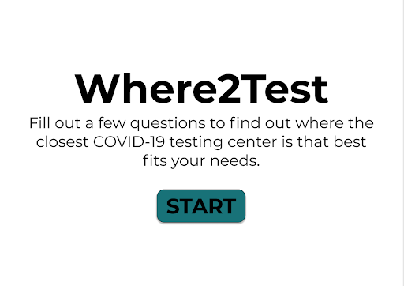
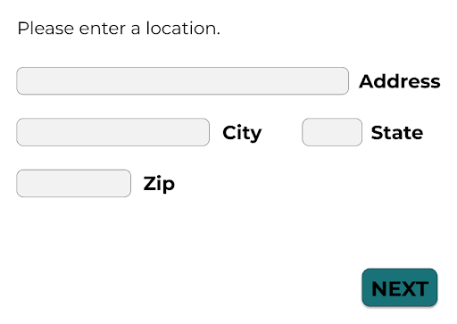
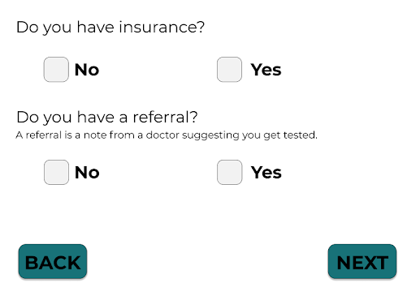
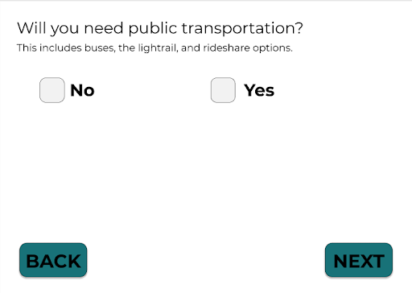
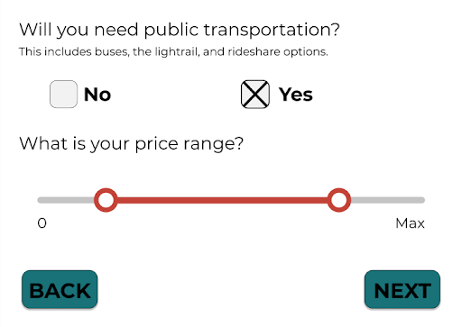
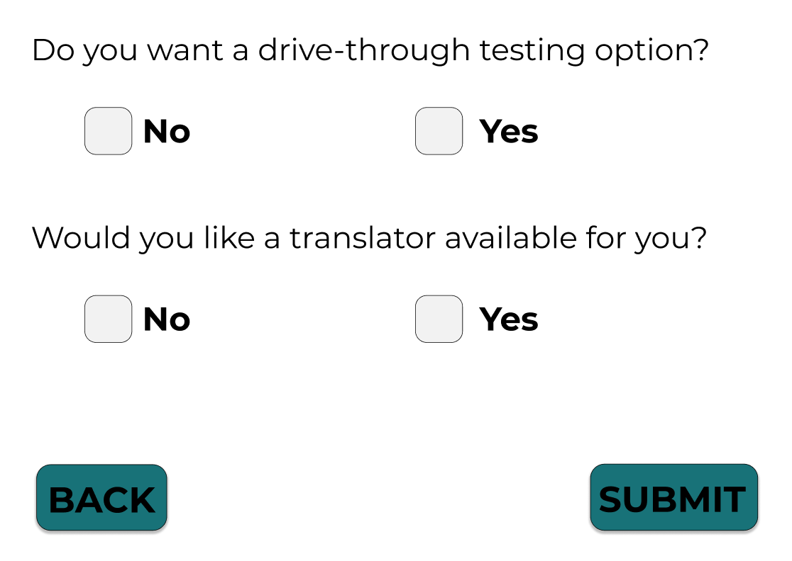
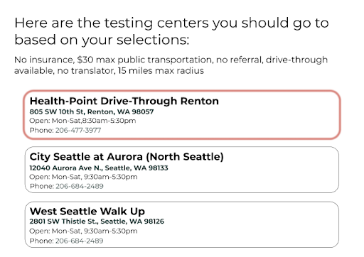
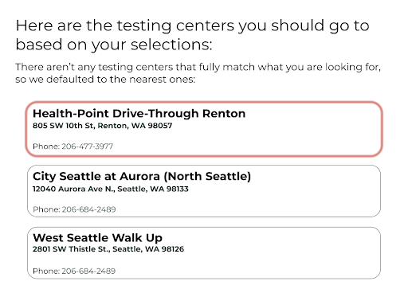
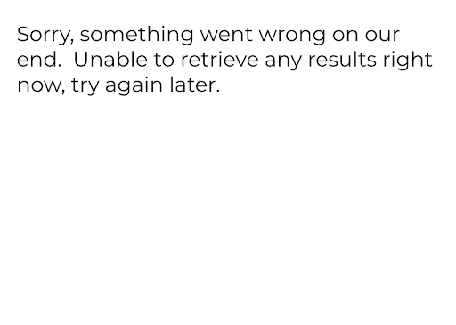

<h2> <strong>PROBLEM:</strong> </h2>
Currently, people around Seattle are encouraged to get tested for COVID-19, however, it is not completely an equitable process to get tested. Google provides a list of COVID-19 testing centers with broad information such as whether it is drive through and whether you need an appointment. However, there are many other factors that disproportionately impact low income and minority communities from getting tested such as insurance, price, and language barriers.  

<h2> <strong>SOLUTION:</strong> </h2>
When you reach our website’s landing page, there will be a short description of the survey, and that the survey will help you find nearby COVID-19 testing centers. Then under the short description there will be a button that says start that will commence the survey’s questions. 

Once you click start, you are brought up to the first screen which asks you to fill in a location. These text boxes will also have autofill for users’ ease.

For this and all following pages with a “NEXT” button, the “NEXT” button will only be able to be submitted if the required fields have been filled out. If not, and the user attempts to click the “NEXT” button, they will receive a pop-up, indicating they have to fill all required fields. After the first question, users will be shown a “BACK” button which will allow them to go back and modify their responses.

After clicking the next button, the user will be asked if they are symptomatic or not with yes/no boxes.

The next screen asks whether or not the user has insurance with the yes/no boxes as well as whether or not they have a referral.

After clicking next, now the user will see a page asking whether they will need public transportation and a short description of how we describe public transportation. If the user selects yes, a price range slider will appear and if they select no nothing will pop up.

After clicking next, they are asked if they want a drive through or not as well as if they would like a translator available at testing (another yes no box check).  After selecting one of the boxes, the user can complete the survey by pressing the “SUBMIT” button. 

Once the submit button is clicked, they are taken to a page with a list of COVID-19 testing centers that meet their criteria and are sorted from closest distance to furthest in Seattle. There is also a short summary of the users’ selections that they made in the survey (a quick overview).

If no testing centers meet the criteria, there will be pop-up text that states that there were no testing centers that matched the criteria but will still provide the closest testing centers.

The testing center results page will have an error message in case of failure to query for a nearby testing center. 

We will require a keyboard for typing in responses and clicking to submit survey questions. There will be no sounds. We will have a responsive interface for mobile and desktop.
