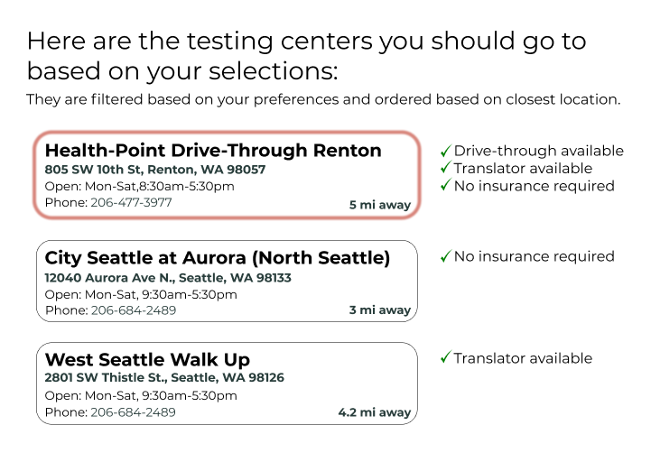

# PROBLEM #
Currently, people around Seattle are frequently encouraged to get tested for COVID-19, however, it is not always easy to find a testing center that fits all of your needs and/or preferences. When you search up ‘COVID-19 testing centers near me’, Google provides a list of testing centers solely based on proximity with general and vague information.  However, there are many other important factors that may determine where one chooses to get tested, such as the availability of drive-through testing, operational hours, and the need for a translator, just to name a few.  Currently, a person would need to navigate through multiple platforms to find out all of this information, which can be a confusing and time-consuming process.

# SOLUTION #
Our solution is a website survey to help users find an appropriate testing center that meets their accommodations. 

When you reach our website’s landing page, there will be a short description of the survey telling you that the survey will help you find nearby COVID-19 testing centers based upon your needs. Under the short description there will be a “START” button, when pressed, will commence the survey.

Once you click start, you are brought up to the first screen which asks you to fill in a specified location. These location text fields should be able to use the browser's autofill capability to autocomplete the location fields. For all screens with a “NEXT” button (which will be all survey questions except the last), the “NEXT” button will be disabled until all questions with an “*” are responded to. 

On all survey question screens following this location page, there will be a “BACK” button which when clicked, will allow users to go back and modify their responses from the previous page.

After clicking the next button, the user will be asked if they are symptomatic or not (based upon a given list of symptoms) with Yes/No checkboxes.  For every question with a Yes/No checkbox, the user will only be allowed to check one or the other, not both.

After clicking next, you will be taken to a screen that asks whether or not the user has insurance and whether or not they have a referral.  Referral will be defined under its respective question.  Both questions will have Yes/No checkboxes underneath.

After clicking next, they are asked if they want a drive through option as well as if they would like a translator available at testing.  There will be a Yes/No checkbox under each question.  After selecting one box for each question, the user can complete the survey by pressing the “SUBMIT” button.  The “SUBMIT” button will be disabled until the user makes selections on all fields with an “*”.

Once the submit button is clicked, the service should first filter a dataset of Seattle testing centers that meet the criteria of the survey. After filtering, the service should use the number of matched criteria and distance from the user’s location to sort the list of testing centers.  The results will be ordered by the number of criteria met (from most to least).  In the event that testing centers have the same number of criteria met, they will then be ordered based upon their location (closest to furthest).  If no criteria are met, the results will default to solely sorting based upon location (closest to farthest).  Lastly, the service will return the sorted and filtered list of testing centers to be displayed. While the service is computing the results, the page will render a loading icon.

The page will display a list of COVID-19 testing centers from the previously described filtering and sorting. Each testing center will have its name, address (when clicked on will lead them to Google Maps with the address already filled in), hours of operation, phone number (which is also clickable that lets them immediately call the number), and how far away it is. To the right of each testing center, the criteria that matches the user’s survey responses will also be listed with checkmarks.

The testing center results page will have an error message in case of failure to query for a nearby testing center. 

We will require a keyboard for typing in responses and clicking to submit survey questions. There will be no sounds. We will have a responsive interface for mobile and desktop.
